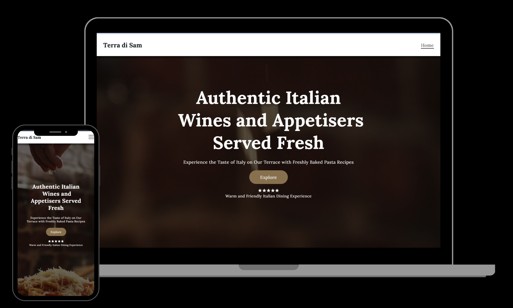

# Terra di Sam

<a href="https://terra-di-sam.vercel.app/" target="_blank">

</a>

## 🤖 Introduction

It is a responsive webpage which is created with Reactjs.

## ⚙️ Tech Stack

- Reactjs
- JavaScript
- CSS

## 🔋 Features

👉Responsive Layout: The design adapts seamlessly to various screen sizes, ensuring optimal viewing on desktops, tablets, and mobile devices.

👉Recipe Section: Displays a collection of recipes with titles, prices, and descriptions. Prices are shown next to recipe names, and images are centered.

👉Review Section: Showcases customer reviews with ratings, descriptions, and customer details. Features side-by-side columns with responsive design adjustments.

👉Styled Components: Uses modern CSS practices for styling, including flexbox for layout and responsive design principles for better user experience.

👉Centered Content: Key content such as headings, subheadings, and images are centered for a clean, professional look.

👉Consistent Design: Maintains a cohesive color scheme and typography across different sections for a unified appearance.

## Github Link

https://github.com/Sam-mx/Terra-di-Sam

## How to Start?

```
npm start
```

```
npm run dev
```
